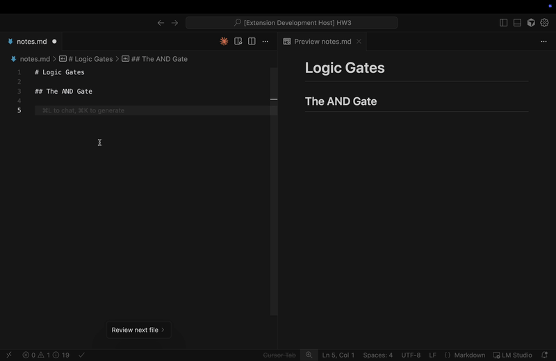
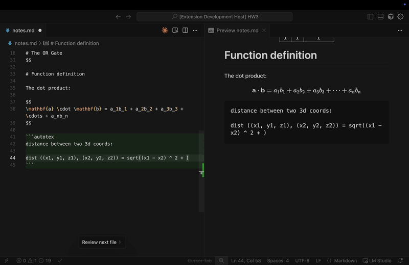

# AutoTeX

**Convert rough draft notes into compilable LaTeX code using AI.**

AutoTeX is a VS Code extension that automatically transforms your rough mathematical notes, equations, and pseudocode into properly formatted LaTeX. Type naturally, press Shift twice, and watch your drafts become beautiful latex elements.

## AutoTeX can...

### Create Tables


### Format Equations




### Write Pseudocode, draw simple graphs, and more!

## Features

-  **Multiple AI Providers**: AutoTeX uses the `Qwen/Qwen3-4B-Instruct` model hosted with LM Studio locally as default to provide instant generation, but you can also use your own OpenAI and OpenRouter keys too.
-  **Smart Detection**: AutoTeX can automatically identify draft sections that need formatting (still in development, not that accurate now)
-  **Visual Highlighting**: See draft sections highlighted as you type
- **Quick Conversion**: Press Shift×2 to convert all drafts instantly.
- **Code Blocks**: Add specific sections to convert with `` ```autotex ``` `` blocks by pressing the Control key.

## Quick Start

1. **Install the extension** from VSIX or build from source
2. **Choose a provider**:
   - **LM Studio** (recommended for privacy): Download from [lmstudio.ai](https://lmstudio.ai/), install a model, start the server
   - **OpenRouter**: Sign up at [openrouter.ai](https://openrouter.ai/) and get an API key
   - **OpenAI**: Get an API key from [platform.openai.com](https://platform.openai.com/)
3. **Configure** via Settings → AutoTeX
4. **Start writing** in any `.tex` or `.md` file

## Basic Usage

### Quick Conversion

Double tap the Control key to insert a AutoTeX code block, and type in your rough drafts or descriptions of what you want to generate. Once you are done, double tap Shift to convert.


Please change the system prompt to suit your specific needs in the extension settings. For note-taking, I find it useful to tell it to make sure the tex code it provides is wrapped with `$$`.

## Installation

### From VSIX File

1. Download `autotex-x.x.x.vsix`
2. In VS Code: Extensions → `...` menu → Install from VSIX

### From Source

```bash
git clone https://github.com/yourusername/autotex.git
cd autotex
npm install
npm run compile
```

Press `F5` in VS Code to run in development mode.

## Documentation

- [Getting Started Guide](docs/getting-started.md) - Detailed setup instructions
- [Provider Configuration](docs/providers.md) - Setup LM Studio, OpenRouter, or OpenAI
- [Settings & Commands](docs/configuration.md) - All available settings and commands
- [Features Explained](docs/features.md) - How draft detection and conversion works
- [Troubleshooting](docs/troubleshooting.md) - Common issues and solutions

## Key Settings

| Setting | Default | Description |
|---------|---------|-------------|
| `autotex.provider` | `lmstudio` | Which AI provider to use |
| `autotex.enabled` | `true` | Enable/disable auto-conversion |
| `autotex.highlightDrafts` | `true` | Highlight draft sections |
| `autotex.autoSaveEnabled` | `true` | Auto-save after conversion |
| `autotex.systemPrompt` | (built-in) | Customize AI behavior |

Open VS Code Settings and search "AutoTeX" to configure.

## Commands

- `AutoTeX: Convert All Drafts to LaTeX` (`Shift+Shift`) - Convert all detected drafts
- `AutoTeX: Insert Code Block` (`Ctrl+Ctrl`) - Insert a manual `autotex` block
- `AutoTeX: Select Provider` - Switch between LM Studio, OpenRouter, or OpenAI
- `AutoTeX: Check Server Status` - Verify provider is available
- `AutoTeX: Toggle Draft Highlighting` - Show/hide draft highlights


## Development

```bash
npm install          # Install dependencies
npm run compile      # Compile TypeScript
npm run watch        # Watch mode for development
npm run lint         # Run ESLint
```

## License

MIT License - See [LICENSE](LICENSE) for details
